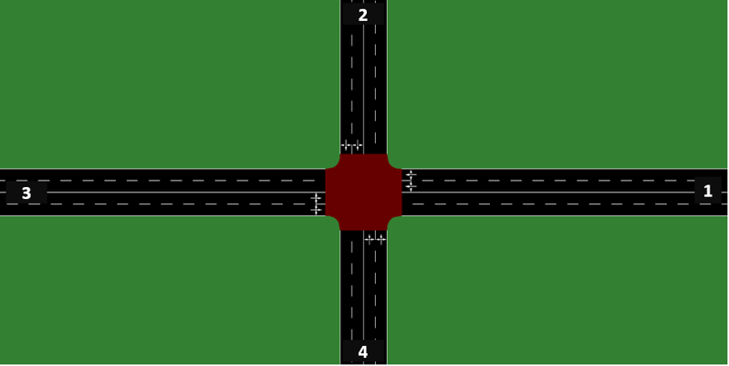
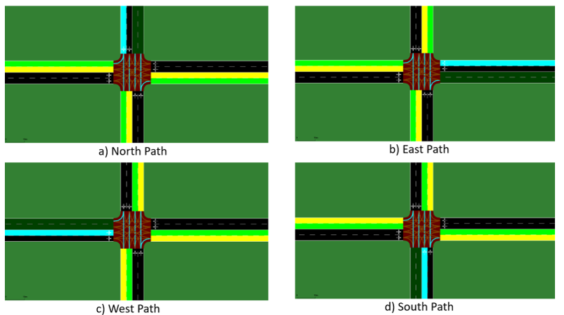

# Enhancement of Smart Traffic Signaling Systems

The project aims to improve traffic signaling systems by utilizing fuzzy logic to minimize waiting time for vehicles and pedestrians during traffic.

  
   
  <strong>Figure-1</strong>: Illustration of an actual four-way intersection with designated phases.

- Phase 1: Roads 2 and 4
- Phase 2: Roads 1 and 3

  
   
  <strong>Figure-2</strong>: Possible turning directions for vehicles on each road.

The blue line denotes the current position of vehicles, while the green lines indicate the available turning directions.

### Repository Structure

The repository consists of three main folders: "Code", "Sumo", and "Files."

#### Code
Inside the "Code" folder, you can find Python scripts that implement the project's functionalities.

#### Sumo
The "Sumo" folder contains four different Sumo traffic scenarios:

1. Real Life
2. Scenario with higher density in Phase 1
3. Scenario with higher density in Phase 2
4. Scenario with approximately equal density in Phase 1 and Phase 2

#### Files
The "Files" folder includes Excel files where waiting times are recorded and a log.txt file containing improvement rates.

### Running the Project

To run the project, follow these steps:

1. Clone the repository to your local machine.
2. Modify the `base_path` variable in the `code/constant_definitions.py` file to match the path where the project is located.
3. Run the main file to execute the project without further modifications.
